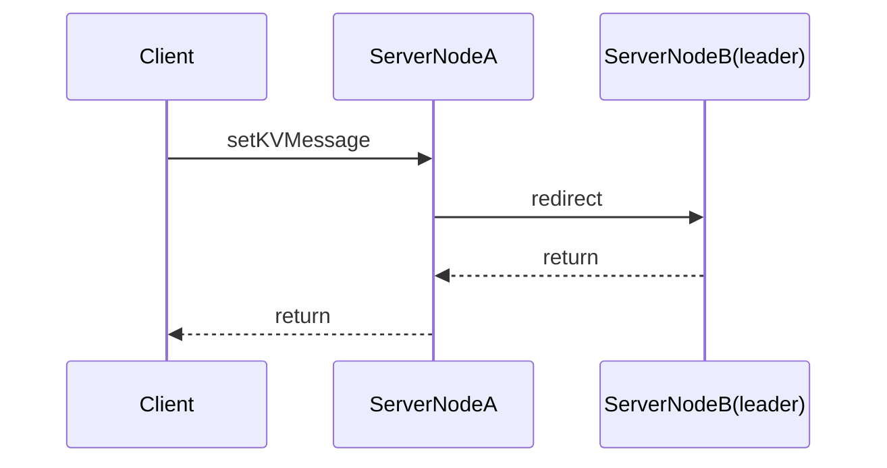

## cheetah-raft
cheetah-raft实现raft协议中的领导选举和日志复制功能，并对leader 宕机， follower宕机，新节点加入，数据同步进行处理。cheetah-raft是cheetah集群强一致性的保证。
### 集群整体架构图

#### raft集群内部接口（集群间相互调用)

 - startNewHeartBeat() 心跳执行，维护leader权威
 - resetElectionTimer() 领导人选举重置Timer
 - redirect() 重定向(不同接口重定向需求不同，在此不一一列举)
 - logReplication() 日志复制

#### raft集群面向客户端调用接口

 - getLeader 获取领导人信息
 - getServerList 获取集群服务器列表
 - getValue 获取数据
 - setKV 存储数据
 - registerServer 注册新节点

#### raft集群调用链 
- 内部 NodeA{RaftCore(init)} ---> NodeB{RaftConsensusService}
- 客户端 client ---> NodeA{RaftConsensusService} ---> NodeA{raftCore}--->
NodeB{RaftConsensusService} ---> NodeB{RaftCore}

#### raft集群接收消息时序图

#### raft集群整体交互

